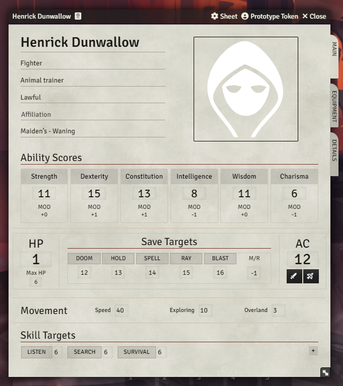

# Dolmenwood Character Sheet (for OSE)

A custom character sheet module for Foundry VTT, designed for Dolmenwood and built on top of OSE character sheet data.

## Requirements

- Foundry VTT `13+` (in `module.json`: `minimum: 13`, `verified: 13`)
- OSE system installed (the module detects and uses the OSE character sheet class as its base)

## Overview

- Three-tab sheet layout: `Main`, `Equipment`, `Details`
- Uses OSE actor system data (HP, AC, attack, movement, abilities, etc.)
- Stores Dolmenwood-specific fields in `actor.flags["yakov-dolmenwood-sheet"].dw`
- Clickable rolls directly from the sheet to chat

## Screenshot



## Core Features

- Ability checks: `1d6 +/- modifier`, success on `>= 4`, natural `1/6` are auto-fail/auto-success
- Skill checks: `1d6`, success on `>= skill value`, natural `1/6` are auto-fail/auto-success
- Save checks: `1d20` against target value
- Attack rolls: `1d20 + modifier` (STR for melee, DEX for ranged), natural `1/20` are auto-fail/auto-success
- Extra skills: add/remove up to 10 custom skill entries
- Equipment management:
  - equipped and stowed item lists
  - per-item weight fields
  - automatic total encumbrance calculation
- Editable text blocks: `Kindred & Class Traits`, `Languages`, `Other Notes`
- Coins block: `copper`, `silver`, `gold`, `pellucidium`

## Default Values

- Base skills: `6`
- New extra skill target: `6`
- Coins: `0`

## Usage

The module registers a custom sheet for `character` actors, but does not set it as default (`makeDefault: false`).
Select it manually in the actor sheet configuration.

## Module Settings

- `Enable debug logging`
- `Enable error notifications`

## Roadmap

- Planned: move away from inheriting the OSE sheet module and make this character sheet fully independent.

## Development

```bash
npm install
npm run build
npm test
```

## Field Implementation Rule

For all new sheet fields, use this order:

1. Add a `DataField` in the DW schema (`src/models/dwSchema.ts`).
2. Render the field in templates via `{{formGroup ...}}` / `{{formInput ...}}` where applicable.
3. Add a listener only for explicit actions (roll buttons, add/remove actions, etc.), not for per-field save on `blur/change`.

## Publishing

1. Bump `version` in `module.json`.
2. Build and package release assets:

```bash
npm run release:local
```

This creates:

- `dist/module.json`
- `dist/dolmenwood.zip`
- `dist/dolmenwood-v<version>.zip`

3. Create a GitHub release/tag (for example `v0.1.0`).
4. Upload `dist/module.json` and `dist/dolmenwood.zip` as release assets.

Foundry manifest URL:

`https://github.com/iosipov27/dolmenwood_character_sheet/releases/latest/download/module.json`

### Optional: automated GitHub release

A workflow is included at `.github/workflows/release.yml`.
If you push a tag like `v0.1.0`, GitHub Actions will build the module and publish:

- `dist/module.json`
- `dist/dolmenwood.zip`
