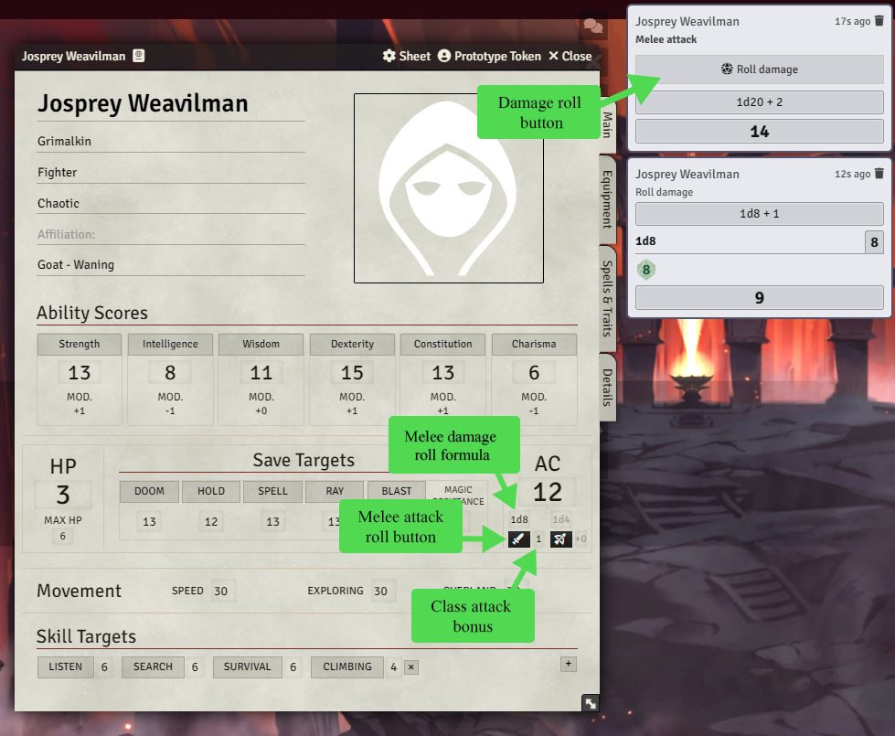

# Dolmenwood Character Sheet (for OSE)

A custom character sheet module for Foundry VTT, designed for Dolmenwood and built on top of OSE character sheet data.

## Requirements

- Foundry VTT `13+` (in `module.json`: `minimum: 13`, `verified: 13`)
- OSE system installed (the module detects and uses the OSE character sheet class as its base)

## Overview

- Four-tab sheet layout: `Main`, `Equipment`, `Spells & Traits`, `Details`
- Uses OSE actor system data (HP, AC, attack, movement, abilities, etc.)
- Stores Dolmenwood-specific fields in `actor.flags["yakov-dolmenwood-sheet"].dw`
- Clickable rolls directly from the sheet to chat
- Ability order follows Dolmenwood preference: `STR`, `INT`, `WIS`, `DEX`, `CON`, `CHA`

## Compendium Compatibility

- Supports OSE compendium items in the sheet tab `Spells & Traits`.
- You can drag-and-drop entries from OSE compendiums directly to the actor.
- Supported item types for this tab:
  - `spell` (upper section)
  - `ability` (traits section)
- Supports your own custom compendium built on top of OSE, as long as items use compatible OSE item types (`spell` / `ability`).

## Screenshot



## Core Features

- Ability checks: `1d6 +/- modifier`, success on `>= 4`, natural `1/6` are auto-fail/auto-success
- Skill checks: `1d6`, success on `>= skill value`, natural `1/6` are auto-fail/auto-success
- Save checks: `1d20` against target value
- Attack rolls:
  - `1d20 + modifier` (STR for melee, DEX for ranged), natural `1/20` are auto-fail/auto-success
  - Includes inline attack bonuses (`Melee Attack Bonus`, `Missile Attack Bonus`)
  - Roll prompt shows modifier sources explicitly (example: `1d20 + 2 (DEX) + 2 (BONUS)`)
- Extra skills: add/remove up to 10 custom skill entries
- Equipment management:
  - equipped and stowed item lists
  - per-item weight fields
  - automatic total encumbrance calculation
- Spells & Traits UX:
  - View toggle with `Cards` and `Text` buttons (`both` mode when both are active)
  - Collapsible `Spells` and `Traits` sections (state is persisted per actor)
  - Dynamic layout/scroll behavior when sections are collapsed or hidden
  - Empty-state hints are shown only when there are no items in the section
- Editable text blocks:
  - `Kindred & Class Traits` editor on the `Spells & Traits` tab
  - `Languages`, `Other Notes` on `Details`
- Coins block: `copper`, `silver`, `gold`, `pellucidium`
- Native dark FVTT dialogs are used for confirmation flows (item/skill deletion)

## Publishing

1. Bump `version` in `module.json`.
2. Build and package release assets:

```bash
npm run release:local
```

This creates:

- `dist/module.json`
- `dist/dolmenwood.zip`
- `dist/dolmenwood-v<version>.zip`

3. Create a GitHub release/tag (for example `v0.1.0`).
4. Upload `dist/module.json` and `dist/dolmenwood.zip` as release assets.

Foundry manifest URL:

`https://github.com/iosipov27/dolmenwood_character_sheet/releases/latest/download/module.json`

### Optional: automated GitHub release

A workflow is included at `.github/workflows/release.yml`.
If you push a tag like `v0.1.0`, GitHub Actions will build the module and publish:

- `dist/module.json`
- `dist/dolmenwood.zip`

### Project Board

- https://github.com/users/iosipov27/projects/1
