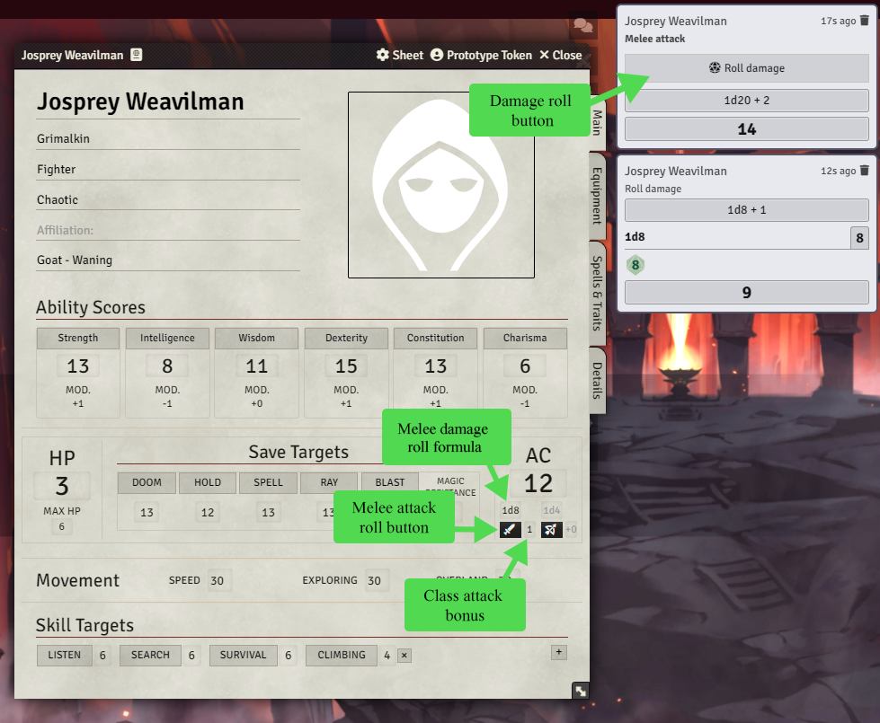
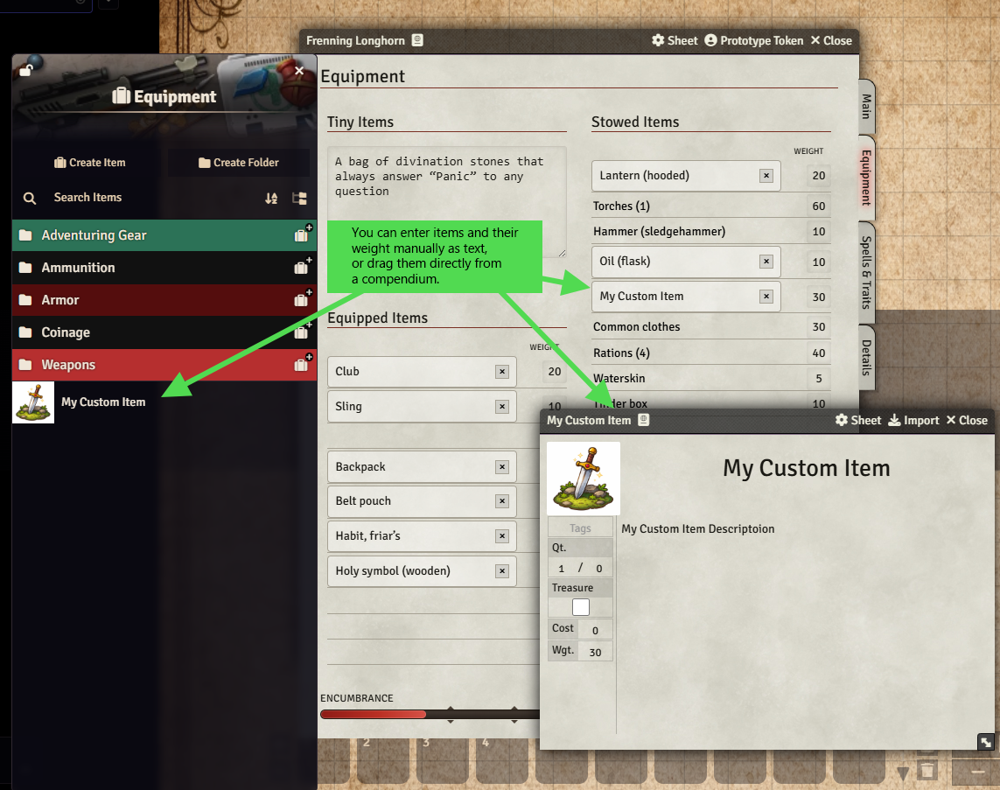

# Dolmenwood Character Sheet (for OSE)

A custom Foundry VTT character sheet for **Dolmenwood** characters using the **OSE** system.

## Compatibility

- Foundry VTT `13+`
- OSE system `2.1.0+`

## Install

Manifest URL:

`https://github.com/iosipov27/dolmenwood_character_sheet/releases/latest/download/module.json`

## Sheet Overview




A clean four-tab sheet built for quick play at the table:

- `Main` for stats, saves, attacks, movement, skills, and quick rolls
- `Equipment` for gear, carried weight, and encumbrance
- `Spells & Traits` for spells, abilities, and class notes
- `Details` for notes, languages, coins, and XP

## Features

- Clickable rolls for abilities, skills, saves, and attacks
- Drag and drop from compendiums into equipment, spells, and traits
- Equipment weight tracking with live encumbrance
- Open or remove linked compendium entries directly from the sheet
- Optional Dolmenwood-specific character fields such as `Affiliation` and `Moon Sign`

## Publishing

1. Bump `version` in `module.json`.
2. Build and package release assets:

```bash
npm run release:local
```

This creates:

- `dist/module.json`
- `dist/dolmenwood.zip`
- `dist/yakov-dolmenwood-sheet-v<version>.zip`

3. Create a GitHub release/tag such as `v1.0.0`.
4. Upload `dist/module.json` and `dist/dolmenwood.zip` as release assets.

Foundry manifest URL:

`https://github.com/iosipov27/dolmenwood_character_sheet/releases/latest/download/module.json`
